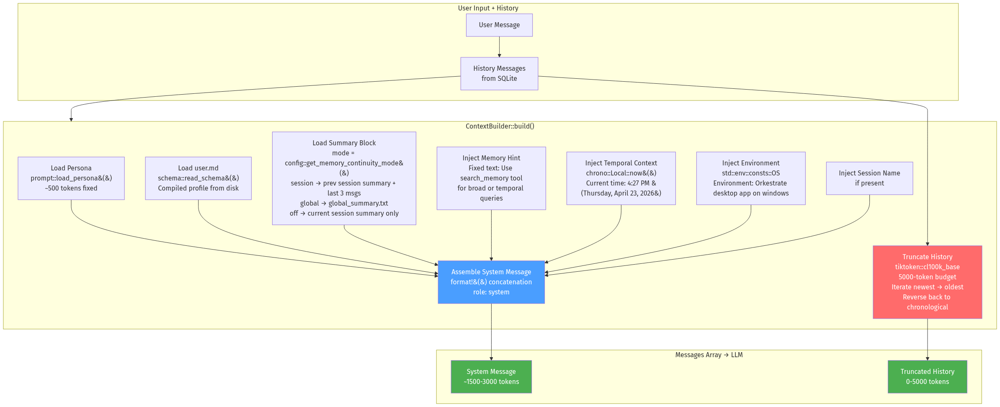
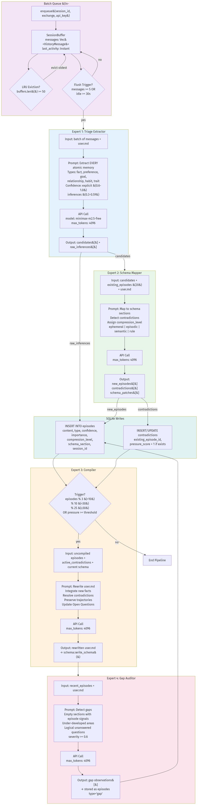
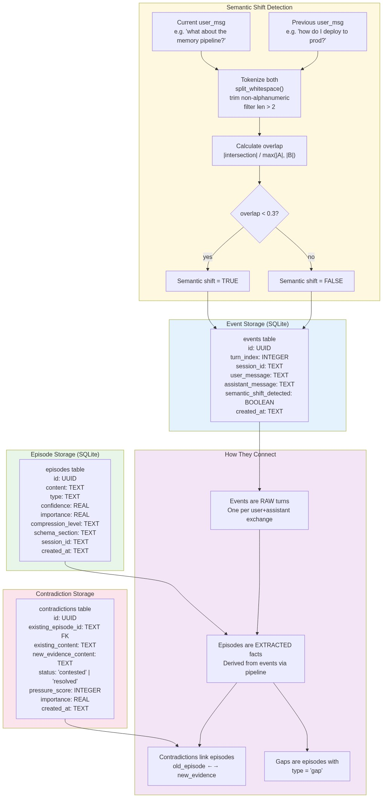
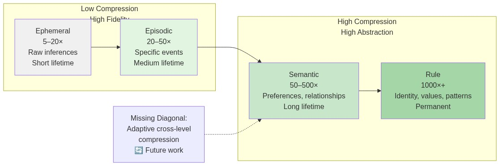

# Orkestrate — A Working Theory of Agent Memory

> Orkestrate is not a chatbot with a database bolted on. It is a second mind — one that listens, remembers, infers, connects, and over time builds a deep, evolving model of who the user is and how they think.
>
> Existing memory systems treat memory as storage-and-retrieval. We treat it as a cognitive process.

---

## 1. Why Existing Memory Systems Fail

Every production memory architecture (Mem0, Zep, Letta, MemGPT, Generative Agents) extracts facts from conversations, embeds them, and fetches them when semantically relevant. This is like building a library and calling it a brain. Human memory is not a library. It is:

- **Lossy by design** — you remember the gist and the feeling, not the transcript
- **Reconstructive** — you rebuild memories each time you access them, which is why they evolve
- **Associative** — memories aren't filed by topic, they're connected by meaning, emotion, timing, and co-occurrence
- **Generative** — your brain combines existing memories to create new thoughts that were never explicitly experienced
- **Self-organizing** — important memories strengthen over time, irrelevant ones fade, patterns emerge without conscious effort

No existing system implements these properties. Orkestrate does.

| Failure Mode | What It Means | Does Orkestrate Solve It? |
|--------------|---------------|---------------------------|
| No consolidation / sleep cycle | Memories are only processed at input time; no periodic review | ✅ Compiler + Gap Auditor run periodically |
| No generative memory | Cannot create memories that were never explicitly stated | ✅ Compiler extracts patterns from multiple episodes |
| No negative space detection | Cannot notice what HASN'T been said | ✅ Gap Auditor detects under-developed profile areas |
| No prospective memory | No forward-looking triggers that fire on future events | 🔄 Planned |
| No importance decay/reinforcement | All memories treated as equally permanent | 🔄 Planned |
| No inferential storage | Stores only what was said, not what was meant | ✅ Extractor captures both explicit facts and raw inferences |
| No semantic search | Keyword-only search misses related concepts | ✅ 2048-dim embeddings + cosine similarity via OpenRouter |
| No duplicate detection | Same fact stored multiple times | ✅ Semantic deduplication at 0.85 similarity threshold |

---

## 2. The Research Foundation

Orkestrate is built on three research papers. Each paper contributes a conceptual layer that is directly mapped to working code.

### 2.1 Memory as Metabolism — Three-Layer Governance Framework

This paper proposes a three-layer architecture for companion knowledge systems:

- **Interaction/Workflow** — how memory is collected, annotated, organized, revisited
- **Representation/Retrieval** — storage format, object types, retrieval index
- **Retention/Governance** — decay, gravity, consolidation, audit

**Our mapping:**

| Paper Layer | Orkestrate Implementation |
|-------------|---------------------------|
| Interaction/Workflow | Batch extraction queue (collect), Triage Extractor (annotate), Schema Mapper (organize), Compiler (revisit/compile) |
| Representation/Retrieval | SQLite with typed episodes (fact/preference/goal/relationship/habit/trait), contradictions table, events table, keyword search with temporal boost |
| Retention/Governance | Compiler as consolidation, Gap Auditor as audit, compression levels as decay granularity, contradiction pressure as gravity |

### 2.2 Experience Compression Spectrum — Unified Compression Levels

This paper positions memory, skills, and rules as points along a single axis of increasing compression:

- **Episodic memory** — 5–20× compression
- **Procedural skills** — 50–500× compression  
- **Declarative rules** — 1000×+ compression

The paper identifies a **"missing diagonal"** — no system supports adaptive cross-level compression.

**Our mapping:**

| Compression Level | Token Reduction | Orkestrate Type | Lifetime |
|-------------------|-----------------|-----------------|----------|
| Ephemeral | 5–20× | Raw inferences, passing mentions | Short — may decay |
| Episodic | 20–50× | Specific events, mentions | Medium — session-scoped |
| Semantic | 50–500× | Durable preferences, relationships | Long — cross-session |
| Rule | 1000×+ | Core identity, values, behavioral patterns | Permanent — compiled into user.md |

Every memory stored in Orkestrate is tagged with a compression level. The Compiler promotes memories upward through the levels based on frequency, corroboration, and importance.

### 2.3 GAM — Hierarchical Graph-Based Agentic Memory

GAM decouples memory encoding from consolidation by isolating ongoing dialogue in an **event progression graph** and integrating it into a **topic associative network** only upon semantic shifts. This minimizes interference while preserving long-term consistency.

**Our mapping:**

- **Event progression graph** — Every turn is stored as an event (`events` table) with turn index, session ID, and semantic shift flag
- **Semantic shift detection** — Keyword overlap algorithm (`gam.rs`): if overlap between consecutive user messages is < 30%, a semantic shift is flagged
- **Topic associative network** — Episodes are linked via 2048-dimensional embeddings (`embedding BLOB` in `episodes` table). Brute-force cosine similarity computes semantic relatedness at query time. Related episodes are fed into the Schema Mapper as context for contradiction detection

---

## 3. System Architecture

### 3.1 Context Assembly

Before the LLM ever sees a prompt, the `ContextBuilder` assembles the full system context. This is not a static template — it is dynamically constructed based on the user's continuity mode, session history, and available memory state.



**Key considerations:**
- The persona is loaded from a file at runtime — editable without recompiling
- `user.md` is the compiled schema, rewritten by the Compiler — it is the most compressed representation
- Summary block changes based on `memory_continuity_mode`: session mode injects previous session continuity, global mode injects a global rolling summary, off mode injects nothing
- Memory hint is hardcoded but tells the agent when to call `search_memory`
- History truncation uses `tiktoken::cl100k_base` (same encoder as GPT-4/Claude) for accurate token counting, not character estimation

### 3.2 The 4-Expert Memory Pipeline

Every conversation turn spawns a background task that runs the memory pipeline. The pipeline is not monolithic — it is a cascade of 4 specialized experts, each with a single responsibility, specific prompt, and token budget.



**How the batch queue works:**
- Each new exchange is pushed to a `SessionBuffer` in a global `HashMap` keyed by session ID
- Buffers are evicted LRU-style when the map exceeds 50 sessions
- A background timer scans every 10 seconds and flushes buffers idle for 30+ seconds
- When a buffer reaches 5 messages, it flushes immediately
- **Why batch?** Previously the extractor ran on every turn with the full conversation history. Now it runs once per 5 exchanges with only those 5 exchanges. This saves ~70–80% of extractor tokens.

**How the experts chain (with two-layer deduplication):**
1. **Triage Extractor** atomizes the conversation into distinct facts. It does not merge — if the user says three things, it extracts three candidates. It also produces low-confidence raw inferences (things implied but not stated).
2. **Pre-Mapper Semantic Search** (NEW) — For each candidate:
   - Generate a 2048-dim embedding via OpenRouter (`nvidia/llama-nemotron-embed-vl-1b-v2:free`)
   - Compare against all existing episode embeddings via cosine similarity
   - If similarity > **0.85** → **duplicate detected**: skip storage, boost existing importance by 0.1
   - Fetch top-15 semantically similar episodes as context for the Mapper
3. **Schema Mapper** receives candidates + their semantic context (top-15 similar memories with similarity scores) + 5 most recent episodes. It detects contradictions using both semantic proximity and recency, assigns compression levels, and decides what to store.
4. **Compiler** rewrites `user.md` when enough new information has accumulated. Trigger conditions are adaptive: compile every 3 episodes when the profile is young, every 10 as it grows, every 25 when mature. High-pressure contradictions also force compilation.
5. **Gap Auditor** runs after compilation and compares the compiled profile against recent episodes. It finds sections that are empty despite signals, or under-developed areas. Gaps are stored as episodes so they participate in future consolidation.

### 3.3 GAM Events and Semantic Shift Detection

The GAM-inspired event system stores every turn as a raw event and detects when the user has changed topic.



**How semantic shift detection works:**
1. Tokenize the current and previous user messages (split on whitespace, trim non-alphanumeric, filter length > 2)
2. Calculate Jaccard overlap: |intersection| / max(|A|, |B|)
3. If overlap < 0.3, flag a semantic shift
4. Store the event in the `events` table with the shift flag

**The storage model:**
- **Events** are raw turns — one per user+assistant exchange. They are never modified after insertion.
- **Episodes** are extracted facts — derived from events via the 4-expert pipeline. They have types, confidence scores, and compression levels.
- **Contradictions** link old episodes to new evidence. They have a pressure score that increments on repeated conflict.
- **Gaps** are episodes with type = 'gap'. They represent negative space — what should be known but isn't.

---

## 4. The Compression Spectrum



**How promotion works:**

1. **Ephemeral** — Raw inferences from the Triage Extractor (confidence 0.3–0.59). Stored immediately but may decay if never corroborated.
2. **Episodic** — Specific facts extracted with high confidence (0.6+). Linked to a session and schema section.
3. **Semantic** — Facts that have been corroborated by multiple episodes or have high importance. The Schema Mapper assigns this level.
4. **Rule** — Core identity information compiled into `user.md` by the Compiler. This is the most compressed, most permanent layer.

The **missing diagonal** is adaptive cross-level compression: automatically promoting an episodic memory to semantic or rule when enough corroborating evidence accumulates. This requires a reinforcement scheduler that we have not yet built.

---

## 5. What's Implemented vs. What's Next

| Feature | Status | Location |
|---------|--------|----------|
| Batch extraction queue with LRU eviction | ✅ Running | `memory/batch_queue.rs` |
| Triage Extractor (atomic fact extraction) | ✅ Running | `memory/triage_extractor.rs` |
| Schema Mapper (contradiction detection) | ✅ Running | `memory/schema_mapper.rs` |
| Compiler (user.md rewrite) | ✅ Running | `memory/compiler.rs` |
| Gap Auditor (negative space detection) | ✅ Running | `memory/gap_auditor.rs` |
| 4 compression levels (ephemeral → rule) | ✅ Mapped | `db.rs` + pipeline |
| GAM event storage + semantic shift | ✅ Running | `memory/gam.rs` |
| Cross-session continuity (3 modes) | ✅ Running | `context.rs` + `config.rs` |
| Persistent turn count + summary triggers | ✅ Running | `db.rs` + `memory/mod.rs` |
| Token-budgeted history truncation | ✅ Running | `context.rs` |
| Contextual tool pruning | ✅ Running | `agent/mod.rs` |
| Memory search with temporal boost | ✅ Running | `tools/search_memory.rs` |
| Summaries UI tab | ✅ Running | `MemoryPanel.svelte` |
| **2048-dim embeddings** (OpenRouter Nemotron) | ✅ Running | `embed.rs` |
| **Semantic deduplication** (0.85 threshold) | ✅ Running | `batch_queue.rs` + `vector.rs` |
| **Two-layer mapper** (5 recent + 15 semantic) | ✅ Running | `schema_mapper.rs` |
| **Hybrid search** (70/30 semantic/lexical) | ✅ Running | `tools/search_memory.rs` |
| **GAM graph structure** (explicit graph edges) | 🔄 Next | Planned: graph table in SQLite |
| **Adaptive cross-level compression** | 🔄 Next | Planned: reinforcement scheduler |
| **Importance decay + reinforcement** | 🔄 Next | Planned: decay curve + access scoring |
| **Prospective memory triggers** | 🔄 Next | Planned: trigger table + hook in agent loop |
| **Sleep cycle automation** | 🔄 Next | Planned: scheduled background task |
| **Multimodal memory** (images, voice, docs) | 🔄 Future | Architecture supports extension |

---

## 6. Memory Store Schema

```sql
-- Core conversation data
sessions (id, name, created_at, last_accessed, turn_count)
messages (id, session_id, role, content, timestamp)

-- Memory fabric
events (id, turn_index, session_id, user_message, assistant_message, semantic_shift_detected, created_at)
episodes (
    id TEXT PRIMARY KEY,
    content TEXT NOT NULL,
    type TEXT NOT NULL,
    confidence REAL DEFAULT 0.5,
    importance REAL DEFAULT 0.5,
    compression_level TEXT DEFAULT 'episodic',
    schema_section TEXT,
    session_id TEXT,
    embedding BLOB,              -- 2048-dim float32 serialized as little-endian bytes
    created_at TEXT NOT NULL
)
contradictions (id, existing_episode_id, existing_content, new_evidence_content, status, pressure_score, importance, created_at, resolved_at)
-- Gaps are stored as episodes with type = 'gap'
```

All memory operations run on `tokio::task::spawn_blocking` to avoid blocking the async runtime. The entire state is in one SQLite file — copy it to back up the entire mind.

---

*Last updated: April 2026 — Embedding pipeline added*
